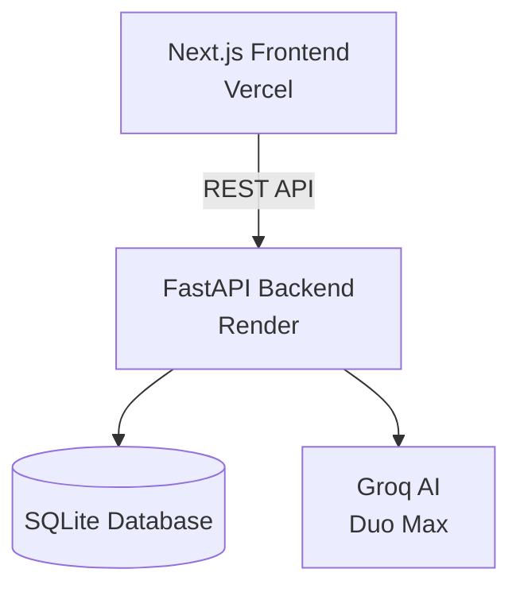
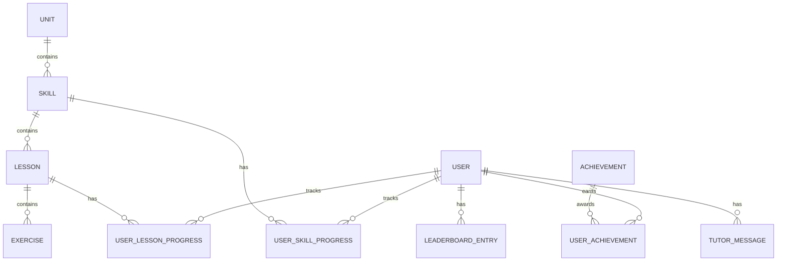

# Scaler Assignment — Duolingo Clone

A full-stack Duolingo-style learning application built with **Next.js 15, TypeScript, FastAPI, SQLAlchemy, SQLite, and Groq AI**.

## Project Links

| Resource | Link |
|---|---|
| Live Application | https://duolingo-clone-tau-black.vercel.app/ |
| Backend API | https://duolingo-clone-9ri3.onrender.com/ |
| GitHub Repository | https://github.com/dityaverma/Duolingo-Clone |

## Demo

[▶ View Demo Video](./duolingoDemo.mp4)


## Features

- Learning path with skill lock/unlock and crown progress
- Interactive lesson player
- Multiple exercise types
- XP, daily goals, and streaks
- Hearts and heart regeneration
- Gems
- Leaderboard and achievements
- Duo Max AI Tutor powered by Groq
- Spanish and Mathematics courses
- Dark mode
- Responsive UI

## System Architecture



## Database Schema

The learning content follows the hierarchy:

**Unit → Skill → Lesson → Exercise**



## Core API

| Method | Endpoint | Description |
|---|---|---|
| POST | `/api/answer` | Validate an exercise answer |
| POST | `/api/lessons/complete` | Complete a lesson and update progress |
| POST | `/api/hearts/refill` | Refill user hearts |
| POST | `/api/tutor/chat` | Chat with Duo Max |
| POST | `/api/tutor/explain` | Generate an exercise explanation |

### Answer Exercise

```json
{
  "exerciseId": "exercise-id",
  "answer": "answer"
}
```

### Complete Lesson

```json
{
  "lessonId": "lesson-id",
  "xpEarned": 15,
  "mistakes": 0,
  "timeSec": 120,
  "mode": "lesson"
}
```

### Tutor Chat

```json
{
  "sessionId": "session-id",
  "message": "Why was my answer incorrect?"
}
```

## Data Models

The backend uses **Pydantic** for request and response validation.

| Model | Purpose |
|---|---|
| `UserOut` | Represents user profile, gamification, settings, and progress |
| `UserUpdate` | Updates user profile and preferences |
| `AnswerRequest` | Submits an exercise answer |
| `AnswerResponse` | Returns answer validation and updated hearts |
| `CompleteLessonRequest` | Submits lesson completion details |
| `HeartsRefillRequest` | Handles heart refill methods |
| `TutorChatRequest` | Sends a message to Duo Max |
| `ExplainRequest` | Requests an exercise explanation |

## Tech Stack

| Layer | Technology |
|---|---|
| Frontend | Next.js 15 |
| Language | TypeScript |
| Styling | Tailwind CSS |
| Animation | Framer Motion |
| Backend | FastAPI |
| ORM | SQLAlchemy Async |
| Validation | Pydantic |
| Database | SQLite |
| AI | Groq |
| Frontend Deployment | Vercel |
| Backend Deployment | Render |

## Project Structure

```text
Duolingo-Clone/
├── frontend/
│   ├── app/
│   ├── components/
│   ├── lib/
│   ├── public/
│   └── package.json
├── backend/
│   ├── app/
│   ├── requirements.txt
│   ├── Dockerfile
│   └── .env.example
├── docker-compose.yml
├── render.yaml
└── README.md
```

## Local Setup

### Backend

```bash
cd backend
python3 -m venv .venv
source .venv/bin/activate
pip install -r requirements.txt
cp .env.example .env
uvicorn app.main:app --host 0.0.0.0 --port 8001 --reload
```

Add the Groq configuration to `.env`:

```env
GROQ_API_KEY=your_api_key
AI_MODEL=groq/compound-mini
```

### Frontend

Open a new terminal:

```bash
cd frontend
npm install --legacy-peer-deps
cp .env.example .env.local
npm run dev
```

Configure `.env.local`:

```env
BACKEND_API_URL=http://localhost:8001
```

### Local URLs

| Service | URL |
|---|---|
| Frontend | http://localhost:3000 |
| Backend | http://localhost:8001 |
| API Health | http://localhost:8001/api/health |

## Deployment

### Backend

The FastAPI backend is deployed on **Render** using Docker and `render.yaml`.

Required environment variables:

```env
GROQ_API_KEY=your_api_key
AI_MODEL=groq/compound-mini
```

### Frontend

The Next.js application is deployed on **Vercel**.

Set the project root to:

```text
frontend
```

Configure:

```env
BACKEND_API_URL=https://duolingo-clone-9ri3.onrender.com
```

## Deployment Challenges

| Challenge | Description |
|---|---|
| Render Cold Start | The backend may take longer to respond after being inactive. |
| SQLite | Suitable for the assignment but PostgreSQL would be more appropriate for a larger production system. |
| CORS | Separate Vercel and Render deployments require correct CORS configuration. |
| Groq API | AI functionality depends on external API availability, latency, and rate limits. |

## Assignment Focus

| Area | Implementation |
|---|---|
| Full Stack | Next.js frontend with FastAPI backend |
| API Design | REST APIs with typed request and response models |
| Database | Relational learning and progress model |
| Learning Engine | Lessons, exercises, answers, and progression |
| Gamification | XP, streaks, hearts, gems, achievements, leaderboard |
| AI | Duo Max tutor and exercise explanations |
| Deployment | Vercel frontend and Render backend |

